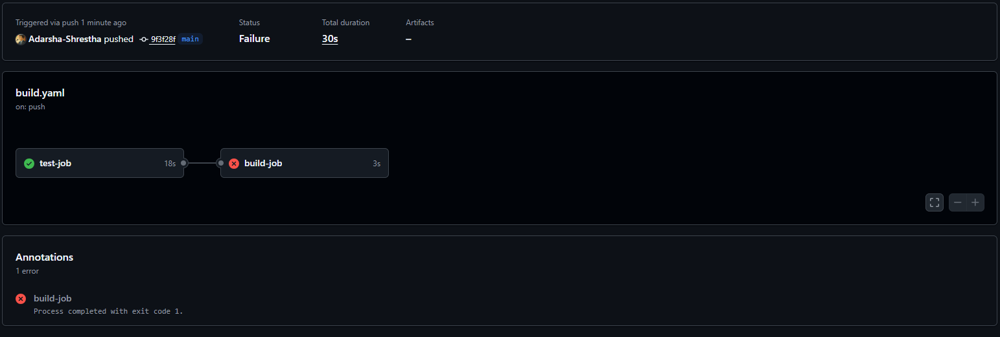
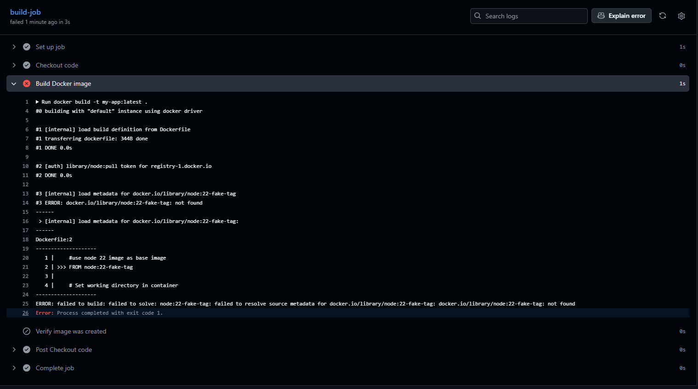
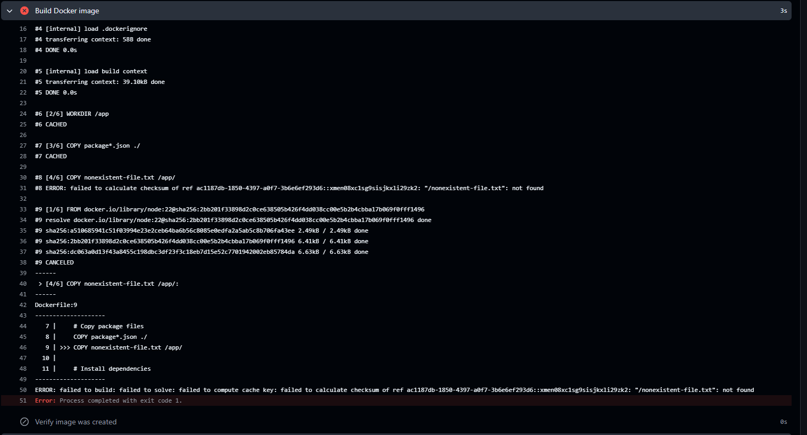

# Assignment 2: Debugging Analysis

## Part A: Working Pipeline Explanation

### Pipeline Overview

My working pipeline from Assignment 1 consists of two jobs that ensure code quality before building.

### Jobs Description

#### 1. test-job

- **Trigger**: Runs on every push to the main branch
- **Purpose**: Validates that the application code works correctly
- **Steps**:
  - Checks out the code from the repository
  - Sets up Node.js environment
  - Installs project dependencies
  - Runs the test suite
- **Failure Impact**: If this job fails, the entire pipeline stops

#### 2. build-job

- **Trigger**: Only runs if test-job succeeds
- **Purpose**: Validates that the Dockerfile is correct and can build an image
- **Steps**:
  - Checks out the code
  - Builds a Docker image using the Dockerfile
  - Verifies the image was created successfully
- **Dependency**: Uses `needs: test-job` to create a dependency

### The `needs:` Keyword

The `needs:` keyword creates a dependency chain between jobs. In our pipeline:

- `build-job` has `needs: test-job`
- This means `build-job` will only execute if `test-job` completes successfully
- If `test-job` fails, `build-job` is automatically skipped
- This prevents us from building broken code into a Docker image

This is a core CI/CD principle: **fail fast and fail early**. We catch errors at the testing stage before wasting resources on building.

---

## Part B: Break and Fix Challenge

### Error 1: Invalid Docker Base Image Tag

#### The Bug

I intentionally broke the Dockerfile by changing:

```dockerfile
FROM node:22
```

to:

```dockerfile
FROM node:22-fake-tag
```

#### Error Screenshot





#### Error Analysis

The error message from Docker was:

```
ERROR: failed to build: failed to solve: node:22-fake-tag: failed to resolve source metadata for docker.io/library/node:22-fake-tag: docker.io/library/node:22-fake-tag: not found
```

**What this means:**

- Docker tried to pull the base image `node:22-fake-tag` from Docker Hub
- This image tag doesn't exist in the registry
- Docker cannot proceed with the build without a valid base image
- The `build-job` failed at the docker build step

#### The Fix

I corrected the Dockerfile by changing it back to:

```dockerfile
FROM node:22
```

This references a valid, existing image tag on Docker Hub. After pushing this fix, the pipeline turned green and completed successfully.

**Links**

- Failed workflow run: https://github.com/Adarsha-Shrestha/LSP-devops/actions/runs/18279765003
- Successful workflow run: https://github.com/Adarsha-Shrestha/LSP-devops/actions/runs/18279844382

---

### Error 2: Missing File in COPY Command

#### The Bug

I intentionally introduced another error by adding:

```dockerfile
COPY nonexistent-file.txt /app/
```

This line tries to copy a file that doesn't exist in my repository.

#### Error Screenshot



#### Error Analysis

The error message from Docker was:

```
ERROR: failed to build: failed to solve: failed to compute cache key: failed to calculate checksum of ref ac1187db-1850-4397-a0f7-3b6e6ef293d6::xmen08xc1sg9sisjkxli29zk2: "/nonexistent-file.txt": not found
```

**What this means:**

- Docker's COPY command looks for files in the build context (your project directory)
- The file `nonexistent-file.txt` doesn't exist
- Docker cannot copy a file that doesn't exist
- The build fails at the COPY instruction

This is different from the first error - it fails during build, not during image pull.

#### The Fix

I removed the invalid COPY line from the Dockerfile:

```dockerfile
# Removed this line:
# COPY nonexistent-file.txt /app/
```

After removing this line and pushing, the pipeline succeeded again.

#### Key Difference Between Errors

| Error        | Stage of Failure | Cause                            |
| ------------ | ---------------- | -------------------------------- |
| Invalid Tag  | Image Pull       | Nonexistent base image tag       |
| Missing File | Build            | Nonexistent file in COPY command |

**Links**

- Failed workflow run: https://github.com/Adarsha-Shrestha/LSP-devops/actions/runs/18279892342
- Successful workflow run: https://github.com/Adarsha-Shrestha/LSP-devops/actions/runs/18279964611

---

## Key Learnings

- Read the error carefully: Both errors clearly stated what went wrong
- Verify image existence: Always check Docker Hub before using an image tag
- COPY requires existing files: All files in COPY commands must exist in your repo
- Different failure points: Errors can occur at different stages of the build
- CI/CD catches errors early: The pipeline prevented broken images from being created

---

## All Workflow Links

- Failed run #1 (Invalid tag): https://github.com/Adarsha-Shrestha/LSP-devops/actions/runs/18279765003
- Successful run #1 (Fixed tag): https://github.com/Adarsha-Shrestha/LSP-devops/actions/runs/18279844382
- Failed run #2 (Missing file): https://github.com/Adarsha-Shrestha/LSP-devops/actions/runs/18279892342
- Successful run #2 (Fixed COPY): https://github.com/Adarsha-Shrestha/LSP-devops/actions/runs/18279964611

---

## Part B: Steps to Follow

### Error 1: Invalid Docker Tag

1. **Break the Dockerfile**: Change `FROM node:22` to `FROM node:22-fake-tag`
2. **Commit and push**:
   ```bash
   git add Dockerfile
   git commit -m "Break: Invalid Docker tag"
   git push
   ```
3. **Watch it fail**: Go to Actions tab, click on the failed run
4. **Take screenshot**: Capture the Docker error message
5. **Fix it**: Revert the Dockerfile change
6. **Commit and push**:
   ```bash
   git add Dockerfile
   git commit -m "Fix: Correct Docker tag"
   git push
   ```
7. **Add screenshot to DEBUGGING.md**

---

### Error 2: Missing File in COPY Command

1. **Break the Dockerfile again**: Add this line before CMD:
   ```dockerfile
   COPY nonexistent-file.txt /app/
   ```
2. **Commit and push**:
   ```bash
   git add Dockerfile
   git commit -m "Break: Missing COPY file"
   git push
   ```
3. **Watch it fail again**: Check Actions tab for new failure
4. **Take screenshot**: Capture the COPY error message
5. **Fix it**: Remove the bad COPY line
6. **Commit and push**:
   ```bash
   git add Dockerfile
   git commit -m "Fix: Remove invalid COPY"
   git push
   ```
7. **Document both errors in DEBUGGING.md**
